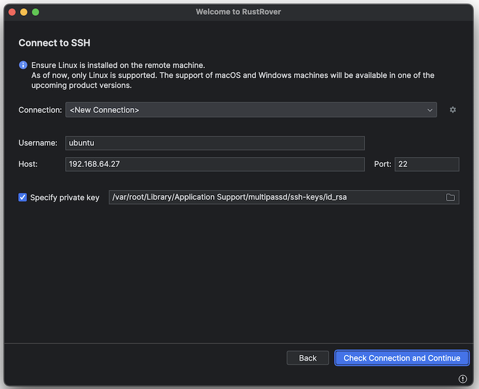
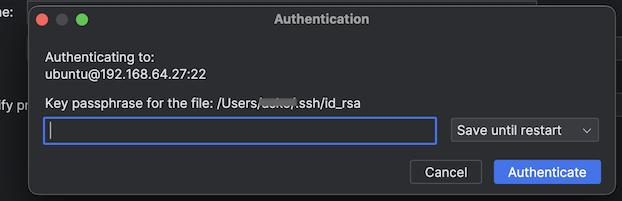

# Setting up SSH


There are [many ways](https://www.tech-otaku.com/vps/enable-root-login-over-ssh-to-multipass-virtual-machines/) (blog; Mar 2023) that we can reach a Multipass VM, using ssh. This is a note, to list what the user tried.

>On macOS 14.2

## 1. Use the Multipass SSH key

As the blog mentions:

>The private key [of Multipass] is stored in an identity file on the host. For macOS, this identity file is `/var/root/Library/Application Support/multipassd/ssh-keys/id_rsa`.

Ideally, we could just feed this public key to Rust Rover, and be done with it. I tried:



It didn't work:



This passphrase is related to the user's default ssh keys, and *should not be needed* when an explicit private key is provided.

>If you don't use passphrase, or don't mind typing it to Rust Rover, this might work.

I reported this to JetBrains, and moved on...

>Note. This can also be due to the private key being in a folder that needs sudo rights (on the Mac). Rust Rover doesn't have them, so.. it might default to other keys.


## 2. Create a key pair, just for Multipass

This (awesome!) [blog post](https://www.ivankrizsan.se/2020/12/23/multipass-key-based-authentication/) by Ivan Krizsan (Dec 2020) describes how to set up a secondary user in the Multipass VM (in addition to `ubuntu`), so one can ssh into the VM.

It seems (I MAY BE WRONG!!!) that changing the ssh key for the default `ubuntu` user (so that one could ssh into *it*) is not that... welcome/possible?

I tried this.

Problem is that `multipass shell` and other stuff doesn't take a user parameter, but only works on the `ubuntu` account. Thus, this kind of puts Remote Development into a corner.

Also, it didn't quite.. work; feels like the user creation was only partial.

```
~/.ssh/multipass
~/.ssh/multipass.pub
```


