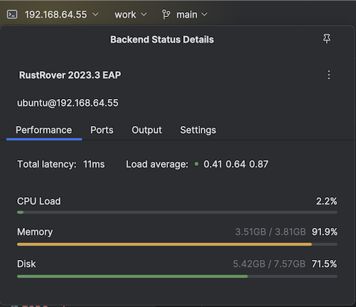

# Using Rust Rover (hints)

## Remote client health metrics

Drop down the IP (`192.168.64.55` in the screenshot), and you'll see useful info about how the remote client is doing.

If something's hitting the ceiling (memory is close!), add more in the `Makefile` and `make purge prep` to restart the client.

>NOTE!!! The Rust Rover remote client installations need to be redone, if you `purge` the existing instance. There may be ways to dynamically change the memory of a Multipass instance. [link](https://github.com/canonical/multipass/issues/1265)

