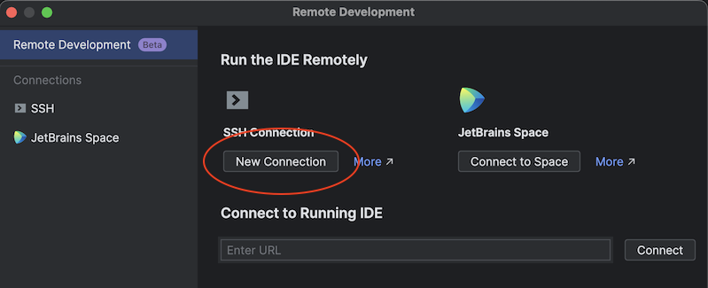
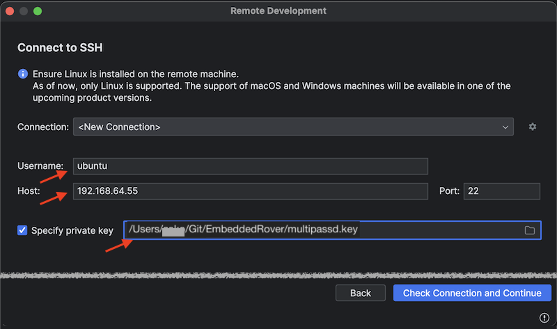
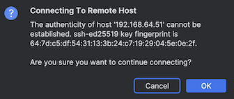
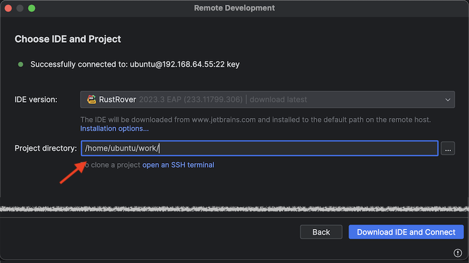

# Embedded Rover

Platform for starting embedded Rust development, with:

- <font color=green>&check;</font> sandboxing
- <font color=red>TBD</font> IDE setup (optional)
- <font color=red>TBD</font> flashing to an embedded board

## Requirements

- [Multipass](http://multipass.run/docs/installing-on-macos) installed
- Gnu Make installed

   <sup>For Mac, comes with Apple's Command Line Tools; install with `xcode-select --install`</sup>

- [Rust Rover Preview](https://www.jetbrains.com/rust/) installed (optional)

<sup>
> Developed on:
> 
> macOS 14.2; Multipass 1.13.0-rc.1308; Gnu make 3.81

><sup>The repo is intended to be supported for Linux (x64) and Windows + WSL2, as well.</sup>
</sup>


## Why sandboxing?

Rust is about safety and security. But installing a development toolchain natively always offers ways for tool or library authors (or intruders who got access to said tools build chain) to peek into secrets on your developer account. The author doesn't want this; nor is it necessary any more, because a) virtualization, b) IDE support for remote development.

>Consider: Just the way [`rustup` is installed](https://rustup.rs) downloads a script from the Internet and executes it. 

This repo showcases use of Multipass and Rust Rover (IDE) for this purpose. This means we (you) end up trusting: your OS author; Canonical (virtualization); JetBrains (IDE). 

><sup>The IDE can naturally be changed to another, e.g. Visual Code, if you prefer that one.</sup>

>Note: ith the sandboxing arrangement, you don't necessarily need to install e.g. HomeBrew on macOS.

### Other benefits

1. With sandboxing, your build system and tool dependencies are more clearly specified and reproducible by other developers (e.g. versioning of tools)
2. Easy to toss away unnecessary build environments.


### CI?

You can still develop also with natively installed tools, and this is the mode you should use in CI, since it's already a sandboxed environment with (hopefully) no access to crucial secrets, except for in production installations. You can build code with less secrets and expose them only for the deployment step (where necessary tools are less).


## Usage

```
$ make prep
...
Multipass IP (b8de3a): 192.168.64.55

rustc 1.74.1 (a28077b28 2023-12-04)
cargo 1.74.1 (ecb9851af 2023-10-18)
 
```

Downloads the Ubuntu image, sets it up for Rust development, and leaves the virtual machine running in the background.

Note the IP address printed out - you'll need it for Remote Development setup of Rust Rover.


### Rust Rover (optional)

**SSH key**

Multipass uses an SSH key pair, to communicate between your developer account and the Multipass virtual machine. We need to provide the *private key* of this key pair to Rust Rover, so that it can initiate an ssh tunnel with the virtual machine's `ubuntu` account.

The private key is stored in:

||path|
|---|---|
|macOS|`/var/root/Library/Application Support/multipassd/ssh-keys/id_rsa`|
|Linux, via&nbsp;Snap|`/var/snap/multipass/common/data/multipassd/ssh-keys/id_rsa`|

<!-- TBD. Windows + WSL
-->

The key is appropriately accessible for super-user only. We copy it "somewhere" and change the access rights so that the Rust Rover desktop application can read it.

>Note: There are other ways of arranging the ssh connection between the parties. See the links under References if you are not at ease with this.
>
>Exposing the private key to user side is not a grade security issue. It's only used to access a child environment, and that environment can be accessed (by `multipass shell`) from our command line, anyways.

```
$ pushd ~/.ssh

$ sudo cp "/var/root/Library/Application Support/multipassd/ssh-keys/id_rsa" multipassd
$ sudo chown multipassd {your-username}
$ sudo chmod a+r multipassd

$ popd
```

>Note the quotes needed because of a space in the path.

**Remote Development setup**

1. Open Rust Rover application
2. `File` > `Remote Development...`

   

3. `New Connection`

	Fill in the fields like in the screenshot, and..

   

   ..press Enter or `Check Connection and Continue`.   

4. Authenticity warning should show up.

   

   Press `OK`.

5. If the connection works, you'll be greeted with:

	

   Enter the `Project directory` as in the image - it's the path, where the project files are mapped, within Multipass.

   Press `Download IDE and Connect`.
   
---   
>‼️ The steps above are not successful. Something "internal" goes wrong, and actual Remote Development cannot be started.
>
>Rust Rover 2023.3 EAP (233.11799.306)

---

<!-- 
tbd. Finish actual steps to:
- debugging in Rust Rover (use the src/main.rs)
- building etc.
-->


## References

- [Enable ssh access to multipass vms](https://dev.to/arc42/enable-ssh-access-to-multipass-vms-36p7) (blog; Aug-22)

   Describes, how to use an existing ssh key, to reach Multipass. Needed for Rust Rover to do Remote Development.

- [Multipass Key-Based Authentication](https://www.ivankrizsan.se/2020/12/23/multipass-key-based-authentication/) (blog; Dec-20)

