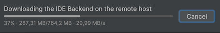
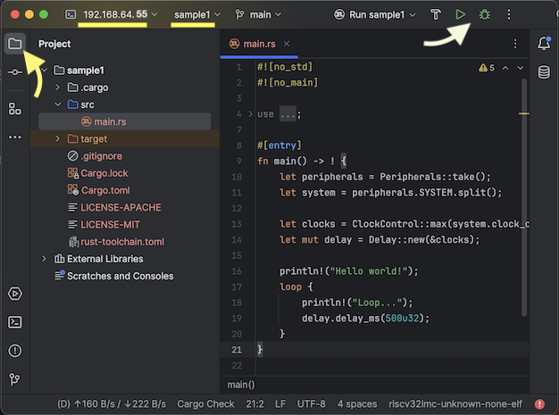
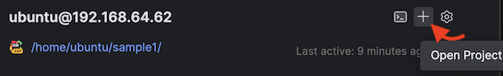

# Embedded Rover

This repo is based on:

- [The Rust on ESP Book](https://esp-rs.github.io/book/)

   Comprehensive documentation by Espressif on developing on ESP32 boards with Rust. 
      
- [ESP32-WSL](https://github.com/lure23/ESP32-WSL)

   Instructions on getting USB device access, onto WSL.

- [ESP32-Mac](https://github.com/lure23/ESP32-Mac)

   Instructions on getting USB device access, onto Multipass (VM) on Mac.

- [esp-template](https://github.com/esp-rs/esp-template)

   `no-std` Rust template, by Espressif.
   
<!-- tbd. esp-idf-template
-->
   
---

Platform for starting embedded Rust development, with:

- <font color=green>&check;</font> sandboxing
- <font color=green>&check;</font> IDE setup
- <font color=green>&check;</font> flashing to an embedded board
- <font color=red>TBD</font> IDE debugging

The instructions are currently made for Mac. 

<!-- hidden
The intention is to support also Windows {10|11} + WSL, eventually.
-->

>Note for Mac users: You will need a **Windows PC for the flashing**, or do the flashing on your own from within macOS. This is due to no proper open source USB/IP servers on the Mac. See `ESP32-Mac` for details.

<!-- disabled (we're on Mac)
<p />
>Running Multipass on Windows requires a Pro license (for Hyper-V), or involves installing VirtualBox. These options are currently out of reach (or want, in the case of VirtualBox) of the author. He prefers adding least host side tools and WSL is from the OS vendor.
-->

## Requirements

- [Multipass](http://multipass.run/docs/installing-on-macos) installed
- [Rust Rover Preview](https://www.jetbrains.com/rust/) installed

For communicating with the development board, you need a Windows PC (Windows 10 Home will do).

<small>
> Developed on:
> 
> - macOS 14.2
> - Multipass 1.13.0-rc
</small>

## Why sandboxing?

Rust is about safety and security. But installing a development toolchain natively always offers ways for tool or library authors (or intruders who got access to said tools' build chain) to peek into secrets on your developer account. This can be passwords, emails, business documents. You don't want that. 

Nor is it necessary to develop on one's full account, any more. We have virtualization and IDE support for remote development. This is becoming a common trend in web development. The role of this repo is to bring it to embedded, ESP32, development as well.

>Consider: Just the way [`rustup` is installed](https://rustup.rs) downloads a script from the Internet and executes it. Even if we trust Rust, it makes their website a lucrative target for attacks.

This repo showcases use of Multipass and Rust Rover (IDE) for this purpose. This means you end up trusting: 

- your OS provider
- Canonical (for Multipass)
- JetBrains (the IDE)

In addition, on Windows you will trust Silicon Labs for a driver and `usbip-win` GitHub repo with 2.6k stars.

>Especially, with the sandboxing arrangement, you don't necessarily need to install [HomeBrew](https://brew.sh/) - a command line tools ecosystem, at all. This reduces your developer account's attack surface. In fact, making HomeBrew optional (though it's great!) is one of the aims of the author.


### Other benefits

1. With sandboxing, your build system and tool dependencies are more clearly specified and reproducible by other developers (e.g. versioning of OS and build tools)
2. Easy to toss away unnecessary build environments.

   This is a big change! If you've "treated containers like cattle" - it's the same for one's development setup. Moo!!!

## CI

You can still develop also with native tools, and this is the mode you should use in CI, since it's already a sandboxed environment with (hopefully) no access to crucial secrets, except for in production installations. You can build code with less secrets and expose them only for the deployment step (where necessary tools are less).

>This ability to develop natively also means that your colleagues don't need to transition to this method when you do. Sandboxing is just a user-specific choice.


## Launch Multipass

```
$ ./prep.sh 
Launched: embedded-rover
Mounted './mp-prime' into 'embedded-rover:/home/ubuntu/.mp-prime'
Get:1 http://security.ubuntu.com/ubuntu jammy-security InRelease [110 kB]
[...]
Multipass IP (embedded-rover): 192.168.64.55

rustc 1.74.1 (a28077b28 2023-12-04)
cargo 1.74.1 (ecb9851af 2023-10-18)
 
```

This command does multiple things:

1. Creates a Multipass VM called `embedded-rover`

   This is the VM you can use for developing embedded Rust projects, within Multipass.

2. Installs Rust, Cargo and ESP development tools

3. Installs drivers, needed to communicate with a development board outside the Multipass VM.

<!-- disabled
>Note the IP address printed out - you'll need it for Remote Development setup of Rust Rover.
-->

## Set up a sample

```
$ multipass shell embedded-rover
[...]

ubuntu@embedded-rover-1:~$
```

This takes you inside the Multipass VM that we set up, above. This is a Linux terminal.

>We'll use `~$` as the prompt when showing commands you can type within Multipass (Linux).

```
~$ mkdir work
~$ cd work
```

Let's use the `cargo generate` template from [The Rust on ESP Book](https://esp-rs.github.io/book/writing-your-own-application/generate-project/index.html) as a warmup. 🧘🧣

>btw. That book is good! If you wish to take a break, you can read it now. Or do both in parallel. :)

Let's start with a `no-std` sample:

```
~$ $ cargo generate esp-rs/esp-template
⚠️   Favorite `esp-rs/esp-template` not found in config, using it as a git repository: https://github.com/esp-rs/esp-template.git
🤷   Project Name: sample1
🔧   Destination: /home/ubuntu/sample1 ...
🔧   project-name: sample1 ...
🔧   Generating template ...
✔ 🤷   Which MCU to target? · esp32c3
✔ 🤷   Configure advanced template options? · false
🔧   Moving generated files into: `/home/ubuntu/sample1`...
🔧   Initializing a fresh Git repository
✨   Done! New project created /home/ubuntu/sample1
```

This creates:

```
sample1
├── Cargo.toml
├── LICENSE-APACHE
├── LICENSE-MIT
├── rust-toolchain.toml
└── src
    └── main.rs
```

We can now set up Rust Rover (IDE) to have a look at this sample, and flash it to your device.


## Rust Rover

Rust Rover is a modern IDE that supports remote development that supports remote debugging (though not of embedded products; more about that later).

**SSH key**

Multipass uses an SSH key pair to communicate between your developer account and the Multipass virtual machine. We provide the *private key* of this pair to Rust Rover, so that it can initiate an ssh tunnel with the virtual machine's `ubuntu` account.

The private key is stored in (macOS):

- `/var/root/Library/Application Support/multipassd/ssh-keys/id_rsa`

<!-- TBD. Windows + WSL
|Linux, via&nbsp;Snap|`/var/snap/multipass/common/data/multipassd/ssh-keys/id_rsa`|
-->

The key is appropriately accessible for super-user only. We copy it somewhere where the Rust Rover desktop application can access it and change the access rights suitably.

>Note: Cannot place it in `~/.ssh`. The desktop app cannot access contents of that folder.

<p />

>Note: There are other ways of arranging the ssh connection between the parties. You can eg. create a new key pair, but it seems unnecessary since we already have a pair.

<p />
>Exposing the private key to user side is not a security issue. It's only used to access a child environment, and that environment can be accessed (by `multipass shell`) from our command line, anyways.

```
$ (sudo cat "/var/root/Library/Application Support/multipassd/ssh-keys/id_rsa") > multipassd.key
```

>Note: The quotes are needed because there's a space in the path.

Remember the path where you placed the key.

**Close earlier connections**

You can have only one remote development session open at a time (as of Jan'24). If you've already worked with Rust Rover, check that the `JetBrains Client-EAP` doesn't have an active windows. If it has, close it.

Otherwise you'll get an error when trying to connect to the remote instance.

**Connecting to Remote client**

1. Open Rust Rover application; then `File` > `Remote Development...`

   

2. `New Connection`

	Fill in the fields like in the screenshot, and..

   

   ..press Enter or `Check Connection and Continue`.   

3. Authenticity warning should show up.

   

   Press `OK`.

4. If the connection works, you'll be greeted with:

	

   Enter the `Project directory` as in the image - it's the path, where the project files are mapped, within Multipass.

   Press `Download IDE and Connect`.

   

   The outcome of all this should be that you see the project opened, as a remote development session:
   
   

>Note: The process will take some time. You can open the `Show all` view to follow the progress:
>
>
   

**Build!**

Click the hammer icon on the toolbar.


The build should start and show up in the console. 


<!-- remove - we've already waited for the updates (Run and Debug are lit)
>Keep an eye on the  build progress bar at the bottom of the IDE. It *will* take a few minutes to complete, fetching dependencies! Only then the `Run` and `Debug` icons light up!!
-->

**Run???**

Before we can run the sample, there needs to be a connection to the target device.

1. Set up a `usbipd` server, as described in [Appendix B](#appendix-b-windows-side-preparation).

   >**You need a Windows PC for this.** If you know, how to set up a `usbipd` server on Mac - that works with the ESP32 board you have - leave a PR in [ESP32-Mac](https://github.com/lure23/ESP32-Mac).

2. With the IP of the Windows USB host known, and `usbipd bind` run on it, let's try attaching to the USB development board from within Multipass VM!

   ```
   ~$ sudo usbip attach -r 192.168.1.29 -b 3-1
   ```

   ```
   ~$ lsusb
   Bus 002 Device 001: ID 1d6b:0003 Linux Foundation 3.0 root hub
   Bus 001 Device 002: ID 10c4:ea60 Silicon Labs CP210x UART Bridge   <<--
   Bus 001 Device 001: ID 1d6b:0002 Linux Foundation 2.0 root hub
   ```

3. Within Rust Rover, push `Run`.

   

   >It *looks* like nothing's happening, but that's simply the `espflash` progress bar and Rust Rover not quite finding themselves. Scroll down, and you'll be greeted with:
   >
   >
   
   Note the "Hello, world" output. 
   
   You can now launch *any* ESP32 program from within the IDE!
   
   

	*<div align=right><font color=gray size=-1>image source: <a href=https://www.icegif.com/fireworks-14>icegif.com</a></font></div>*


**Interim - PLEASE 🛑**

Stop the running code.

NOW! This is easily said, but doesn't seem possible. See [TRACK](./TRACK.md).

- Close the VM by `multipass restart embedded-rover` in the macOS command line
- Close EAP client
- start again

>NOTE!! If you use `cargo run` from the IDE Terminal, instead of integrated `Run` command, you can stop the execution with `Ctrl-C`.


**State of (remote) debugging?**

Rust Rover (Preview) does not support debugging other than a few (`x86_64` and `arm64`) architectures.

However, IntelliJ's other IDE, CLion, does. It does this using [OpenOCD](https://openocd.org) support. 

There is also another debugging ecosystem, called `probe-rs`, in the Rust world. The Rust on ESP book [lists their support](https://esp-rs.github.io/book/tooling/debugging/index.html):


That looks pretty good!

Let's set the repo ready for OpenOCD, so if (when) IntelliJ decides it's supported not only by CLion but Rust Rover as well, we are ready. 

After that, we'll look into how debugging can currently be done, from the terminal (no IDE).


<!-- yeah right, did not work.. #later
**Trying 'std' sample**

Before we get to OpenOCD, let's do another Rust sample. This one is based on [esp-idf-template](https://esp-rs.github.io/book/writing-your-own-application/generate-project/esp-idf-template.html).

Within the VM, install "IDF" dependencies:

```
~$ . ~/.mp-prime/esp-idf-template.sh
```

These are not necessarily set up, by default, to save space. `#flux`

```
$ cd

$ cargo generate esp-rs/esp-idf-template cargo
⚠️   Favorite `esp-rs/esp-idf-template` not found in config, using it as a git repository: https://github.com/esp-rs/esp-idf-template.git
🤷   Project Name: hello
🔧   Destination: /home/ubuntu/hello ...
🔧   project-name: hello ...
🔧   Generating template ...
✔ 🤷   Which MCU to target? · esp32c3
✔ 🤷   Configure advanced template options? · true
✔ 🤷   ESP-IDF version (master = UNSTABLE) · v5.1
✔ 🤷   Enable STD support? · true
✔ 🤷   Configure project to use Dev Containers (VS Code and GitHub Codespaces)? · true
✔ 🤷   Configure project to support Wokwi simulation with Wokwi VS Code extension? · false
✔ 🤷   Add CI files for GitHub Action? · false
🔧   Moving generated files into: `/home/ubuntu/hello`...
🔧   Initializing a fresh Git repository
✨   Done! New project created /home/ubuntu/hello
```

Close any existing Remote Development session:

- JetBrains EAP Client > `File` > `Close project` (or just close the window) > 

- Note that both JetBrains EAP Client and the Java application icons disappear. Rust Rover remains running.

- Here, instead of `New Project`, use the existing VM entry and click `+`:

   
   
   This adds a new project folder to an existing remote instance.

- Try `cargo build`

   

   That could be anything!  Not going further - best to wait, since these are "nightly"?
   
   🛑
-->   


**Launching OpenOCD**

It's possible Rust Rover will support debugging over OpenOCD, at some point. Let's be prepared?

For ESP32-C3:

```
$ openocd -f board/esp32c3-builtin.cfg
```


<!-- tbd. Installing / using OpenOCD?
-->


**Debugging Rust code running in ESP32??**

<font color=red>tbd. What can we do from the terminal?</font>


## Sharing work folders

Above, we've created work folders only within the Multipass VM.

If you for some reason want to access them also on the host, create them on the host, and map to the VM:

```
$ mkdir cow

$ multipass mount cow embedded-rover:/home/ubuntu/cow
```

>Note! You cannot map to an already existing work folder within the VM. If you try this, the command will succeed but the folder will be empty. To undo, use `multipass umount`.

But.. populating such a folder may be difficult, since `git clone` or `cargo generate` create a folder automatically. The author would likely:

- use a temporary name for the creation
- move all contents from the temporary name to the mapped (shared) folder
- remove the temporary name

As you can see, this is a bit tedious. There may be other ways of sharing a folder in a VM. Perhaps JetBrains Remote Development has a way for this (that goes VM -> local).


## Troubleshooting

### Unable to connect for Remote Development

If you get an error after pressing `Download IDE and Connect`, check that you don't already have an active EAP session running.

If you do, close it and try connection again. 


### Disk full!

First, you can try:

```
~$ rm -rf ~/.cache/*
```

>To see how much space is available:
>
>```
>~$ df -h .
>Filesystem      Size  Used Avail Use% Mounted on
>/dev/sda1        12G  9.5G  2.0G  84% /
>```

It's good to have ~2G airspace.

---

If you need to extend the  Multipass VM, that's possible (but requires you to close the VM):

```
$ multipass stop embedded-rover

$ multipass set local.embedded-rover.disk=12G

$ multipass shell embedded-rover
```


## Appendix B. Windows side preparation

Follow the steps in the [https://github.com/lure23/ESP32-WSL](https://github.com/lure23/ESP32-WSL) repo, to install device drivers and set up `usbip` sharing for them. 

>This requires a Windows computer. The author was unable to set up `usbipd` properly, on a Mac. See [https://github.com/lure23/ESP32-Mac](https://github.com/lure23/ESP32-Mac) if you wish to help.

In a command prompt with Admin rights:

```
> usbipd list
Connected:
BUSID  VID:PID    DEVICE
3-1    10c4:ea60  Silicon Labs CP210x USB to UART Bridge (COM4)
[...]
```

```
> usbipd bind -b 3-1
```

DO NOT do the `attach` from the Windows side. We do it from Multipass. For this, we need the Windows machine's IP - grab it e.g. from `ipconfig` output. (We're using `192.168.1.29`.)

>Naturally, the computers need to be in the same network. The port 3240 is used by the `usbip` protocol - both Mac and Windows should pass it through, so all this is possible.

```
~$ usbip list -r 192.168.1.29
Exportable USB devices
======================
 - 192.168.1.29
        3-1: Silicon Labs : CP210x UART Bridge (10c4:ea60)
           : USB\VID_10C4&PID_EA60\BC2F214F809DED11AAFA5F84E259FB3E
           : (Defined at Interface level) (00/00/00)
           :  0 - Vendor Specific Class / unknown subclass / unknown protocol (ff/00/00)
```

That looks plenty good!

Note that only one of the USB devices is presented to us. The one we used `bind` on the Windows side.

```
~$ sudo usbip attach -r 192.168.1.29 -b 3-1
```

To check what USB devices the VM sees (optional):

```
~$ lsusb
Bus 002 Device 001: ID 1d6b:0003 Linux Foundation 3.0 root hub
Bus 001 Device 002: ID 10c4:ea60 Silicon Labs CP210x UART Bridge
Bus 001 Device 001: ID 1d6b:0002 Linux Foundation 2.0 root hub
```

That should be it!


## References

- [Enable ssh access to multipass vms](https://dev.to/arc42/enable-ssh-access-to-multipass-vms-36p7) (blog; Aug-22)

   Describes, how to use an existing ssh key, to reach Multipass.
