# Embedded Rover

Platform for starting embedded Rust development, with:

- <font color=green>&check;</font> sandboxing
- <font color=green>&check;</font> IDE setup (optional)
- <font color=red>TBD</font> flashing to an embedded board

## Requirements

- [Multipass](http://multipass.run/docs/installing-on-macos) installed
- Gnu Make installed

   <sup>For Mac, comes with Apple's Command Line Tools; install with `xcode-select --install`</sup>

- [Rust Rover Preview](https://www.jetbrains.com/rust/) installed (optional)

<sup>
> Developed on:
> 
> macOS 14.2; Multipass 1.13.0-rc.1308; Gnu make 3.81

><sup>The repo is intended to be supported for Linux (x64) and Windows + WSL2, as well.</sup>
</sup>


## Why sandboxing?

Rust is about safety and security. But installing a development toolchain natively always offers ways for tool or library authors (or intruders who got access to said tools build chain) to peek into secrets on your developer account. The author doesn't want this; nor is it necessary any more, because a) virtualization, b) IDE support for remote development.

>Consider: Just the way [`rustup` is installed](https://rustup.rs) downloads a script from the Internet and executes it. 

This repo showcases use of Multipass and Rust Rover (IDE) for this purpose. This means we (you) end up trusting: your OS author; Canonical (virtualization); JetBrains (IDE). 

><sup>The IDE can naturally be changed to another, e.g. Visual Code, if you prefer that one.</sup>

>Note: ith the sandboxing arrangement, you don't necessarily need to install e.g. HomeBrew on macOS.

### Other benefits

1. With sandboxing, your build system and tool dependencies are more clearly specified and reproducible by other developers (e.g. versioning of tools)
2. Easy to toss away unnecessary build environments.


### CI?

You can still develop also with natively installed tools, and this is the mode you should use in CI, since it's already a sandboxed environment with (hopefully) no access to crucial secrets, except for in production installations. You can build code with less secrets and expose them only for the deployment step (where necessary tools are less).


## Usage

```
$ make prep
...
Multipass IP (b8de3a): 192.168.64.55

rustc 1.74.1 (a28077b28 2023-12-04)
cargo 1.74.1 (ecb9851af 2023-10-18)
 
```

Downloads the Ubuntu image, sets it up for Rust development, and leaves the virtual machine running in the background.

Note the IP address printed out - you'll need it for Remote Development setup of Rust Rover.


### Rust Rover (optional)

**SSH key**

Multipass uses an SSH key pair, to communicate between your developer account and the Multipass virtual machine. We need to provide the *private key* of this key pair to Rust Rover, so that it can initiate an ssh tunnel with the virtual machine's `ubuntu` account.

The private key is stored in:

||path|
|---|---|
|macOS|`/var/root/Library/Application Support/multipassd/ssh-keys/id_rsa`|
|Linux, via&nbsp;Snap|`/var/snap/multipass/common/data/multipassd/ssh-keys/id_rsa`|

<!-- TBD. Windows + WSL
-->

The key is appropriately accessible for super-user only. We copy it somewhere where the Rust Rover desktop application can access it (e.g. the project folder itself) and change the access rights suitably.

>Note: Cannot place it in `~/.ssh`. The desktop app cannot access contents of that folder (can it?).

<p />

>Note: There are other ways of arranging the ssh connection between the parties. See the links under References if you are not at ease with this.
>
>Exposing the private key to user side is not a grade security issue. It's only used to access a child environment, and that environment can be accessed (by `multipass shell`) from our command line, anyways.

```
$ sudo cp "/var/root/Library/Application Support/multipassd/ssh-keys/id_rsa" multipassd.key
$ sudo chown multipassd.key {your-username}
$ sudo chmod a+r multipassd.key
```

>Note the quotes needed because there's a space in the path.

**Connecting to Remote client**

1. Open Rust Rover application
2. `File` > `Remote Development...`

   

3. `New Connection`

	Fill in the fields like in the screenshot, and..

   

   ..press Enter or `Check Connection and Continue`.   

4. Authenticity warning should show up.

   

   Press `OK`.

5. If the connection works, you'll be greeted with:

	

   Enter the `Project directory` as in the image - it's the path, where the project files are mapped, within Multipass.

   Press `Download IDE and Connect`.


   The outcome of all this should be that you see the project opened, as a remote development session:
   
   
   

**Build and Debug!!**

You should now be able to build the sample program (`src/main.rs`)..

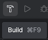

Click the hammer icon on the toolbar.

The build should start and show up in the console. 


>Note that this happens in the remote instance.

Then ... not sure what caused this to occur, but eventually in the top menu bar there is:


>TBD. Do the icons show up automatically?

This means we can run and debug the remote instance. YAY!!!

Push `Run`.


Make a breakpoint on line 2 (click it) and press `Debug`.


If we had variables, you would see their values here. Press `Resume Program` to let it run its way. 

This concludes our setup!

You now have a working, sandboxed environment for Rust development.


<!-- DISABLED; may not have been needed?
Next, we need to create a configuration so that the debugging features of the IDE can be utilized.

1. Click `Current File` > `Edit Configurations...`

   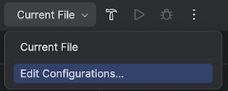

	.. `+` > `Cargo`
	
	>If you've used any JetBrains IDEs before, this should look familiar. It's where compile/debug/test time properties are declared. You can define multiple such configurations, if you have the need.
	
   Switch `Run on:` to `SSH`
   
   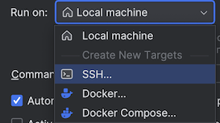

   ..and provide the host and username values
   
   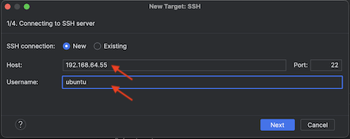

	>Note: The author doesn't know why JetBrains EAP wouldn't use the values we've already provided. 
	>If you don't remember the IP, you can run `make prep` again. It doesn't harm.

	Note that this is display `1/4` of the target wizard. Let's see what's coming - press `Next`.
	
   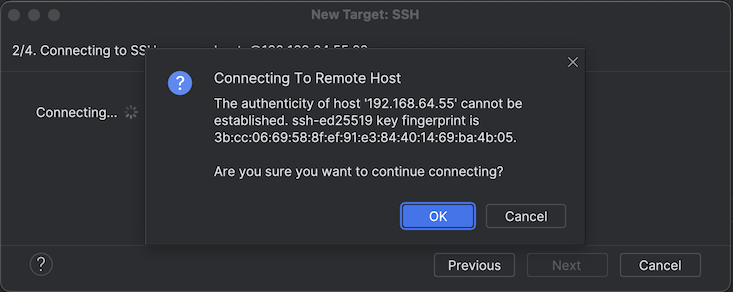

	We've seen that! Press `OK`.
	
	>⚠️ The reason we get the same request again must be due to still suboptimal integration between the Rust Rover (where we've OK'ed this) and the EAP client (who's now asking). Rust Rover is still in PREVIEW mode; hopefully this section of target creation gets ironed out before actual release!

   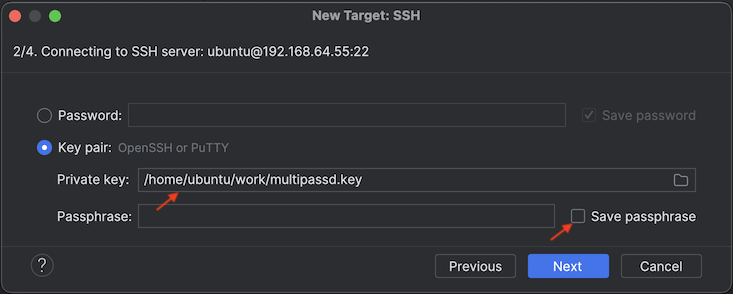

	>The "private key" asked here *should* be from our local (desktop) account, right?  But the dialog presents the file system of the remote instance... That's strange.
	>
	>We happen to share the key on that side, too, so let's pick it.
	>
	>Ideally, NONE OF THIS SHOULD BE SEEN since we've already touched base with the remote client.

	><font color=red>JetBrains BUG??</font> Should the dialog show local files - but then again, please cut this whole wizard out? 🙂

	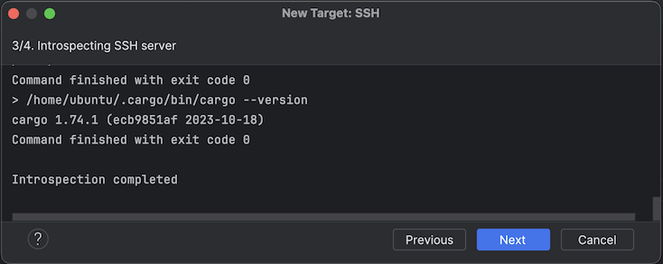
	
	Press `Next`.
	
	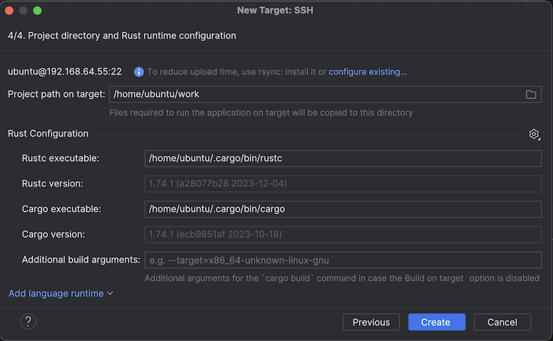

	Here, no changes are needed.
	
	>Note: If you click the "configure existing..." and check `rsync` connection, it seems to be there just fine.
	>
	><font color=orange>JetBrains: Can you remove the warning text if `rsync` connection is available?</font> - or am I doing something wrong..

	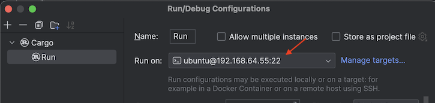
	
	We now have a Rust compilation/debug/testing target that's remote. Press `OK`.
	
	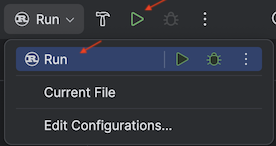
	
	Notice that there's a new `Run` target. Click it!

---
‼️	Here, EAP seems to get stuck for a while (> 1 min?) and then fails.


☐ <font color=red>JetBrains BUG</font> or an issue with my setup=?

---

The `Debug` feature doesn't seem to be implemented, at this moment (2023.3.1 EAP).

-->


<!-- DISABLED since we got Debug to work
## You leave me here??

Yes. :)

Though the IDE features seem to be still in flux, you can *absolutely* do development using the Rust Rover + EAP + Multipass toolchain.

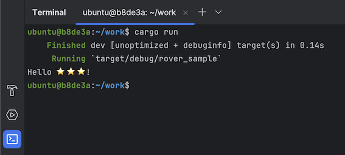

Press the terminal icon (highlighted in the screen shot) and you can do the normal `cargo run`, `cargo build` etc. in the remote instance.

What you'll get in addition is:
-->


## Next 

We can each go our ways, now. Use the `Makefile` in this repo as a basis for your Rust endeavours, if you like. Consider it Public Domain.

The author has an ESP32 board in mail, for being the target of his Rust adventures. There may be additions to this repo (thus its name, "Embedded Rover").

What's naturally welcome are:

- any corrections; either in Discussions, Issues or PRs. Thanks!!!
- additional material on setting up the same on Windows + WSL2 developer account (or Linux)

   >Note! Multipass requires a Windows Pro license, in order to use Hyper-X virtualization. Otherwise you'll need to install VirtualBox. 🥴


That's all for now! 🌼


## References

- [Enable ssh access to multipass vms](https://dev.to/arc42/enable-ssh-access-to-multipass-vms-36p7) (blog; Aug-22)

   Describes, how to use an existing ssh key, to reach Multipass. Needed for Rust Rover to do Remote Development.

- [Multipass Key-Based Authentication](https://www.ivankrizsan.se/2020/12/23/multipass-key-based-authentication/) (blog; Dec-20)

