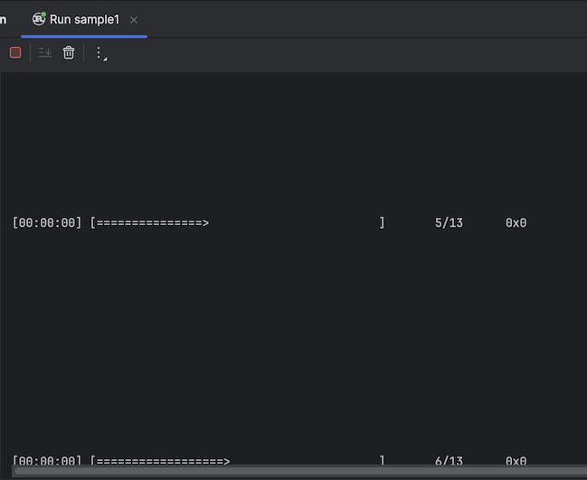
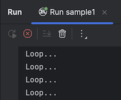
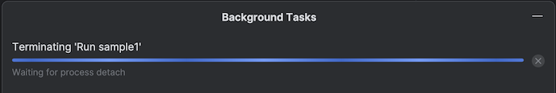
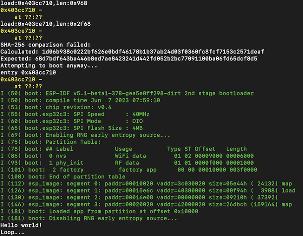
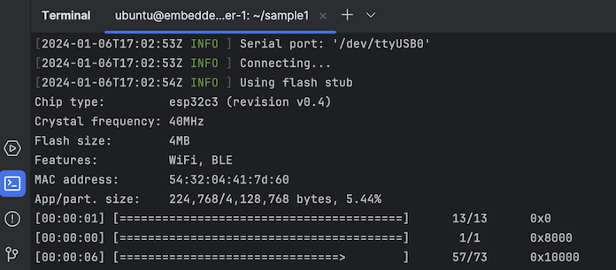
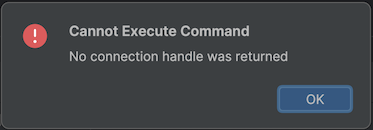

# TRACK

Here are issues that have been spotted on:

- RustRover Preview

## Running OpenOCD ESP32 variant

- [Issue 311](https://github.com/espressif/openocd-esp32/issues/311) on `openocd-esp32`

- [ ] Can we get a comment from Espressif?

## `Run` output misbehaves on ESP32

`RustRover 2023.3 EAP`

Expected:

- Progress bar of `espflash` would stay on the same line

Actual:

- Output disappears past the scrolling horizon and the user might feel nothing's happening.

Work-around:

Scroll down, manually, until the program's output is seen.

## Stop not working

`RustRover 2023.3 EAP`

Steps:

- Run a "no-std" ESP32 sample, from the IDE
- observe: it gives output
- press "Stop" button (either top of window or near the run output - as in the screenshot)

Expected:

- execution stops
- stop button is no longer enabled

Actual:

- nothing

Work-around???:

- close the "Run sample1" window
- confirm
- 
- ...which does not complete, so click 'x'

This leads to a state in the IDE that has the stop button dimmed, but feels wrong. @JetBrains, have a look? 🌸

<!-- to fully restart:

`multipass restart embedded-rover` on the Mac host
-->

<!-- minor; if they fix progress, this will likely be dealt with as well?=
## No colors in `Run` output

`espflash` output uses colors:

Expected:

- When run from within the Rust Rover IDE, I will see the same colors on the Run output.

Actual:

- Run output lacks colors

Work-around:

- Within the IDE, don't use `Run` but the terminal - and command `cargo run`:

   
   
   >Note that both the progress bars and colors work great!
-->

## No proper error if EAP Client is already running

`RustRover 2023.3 EAP`

It seems that one can only have one project active in the EAP Client. 

Steps:

- Develop one thing; leave it open in the EAP Client (it may be disconnected from the VM)
- Start another thing: `New Connection`

Expected:

- The IDE would tell that I already have a session open, and suggest terminating it.

Actual:

- Nothing seems to happen, but there's this error dialog in the Gateway:

   

Work-around:

- Manually close the EAP Client, and try again.

## Rust Rover - Umbrella ticket on Embedded use case

- [Support embedded debugging](https://youtrack.jetbrains.com/issue/RUST-12499)

   JetBrains collects embedded debugging use cases / issues under this ticket.
