# Embedded Rover

Platform for starting embedded Rust development, with:

- <font color=green>&check;</font> sandboxing
- <font color=green>&check;</font> IDE setup (optional)
- <font color=green>&check;</font> flashing to an embedded board
- <font color=red>TBD</font> debugging

The instructions are currently made for Mac. You will need a Windows PC for the flashing, as well (development board needs to be connected to Windows, not Mac - more details below). 

Running Multipass on Windows requires a Pro license (for Hyper-V), or involves installing VirtualBox. These options are currently out of reach (or want, in the case of VirtualBox) of the author; he prefers Windows + WSL development (no extras needed; works on Home license) 😀. If you have Windows {10|11} Pro and wish to duplicate the steps, let us know!


## Requirements

Mac option:

- [Multipass](http://multipass.run/docs/installing-on-macos) installed
- Gnu Make installed

   >For Mac, comes with Apple's Command Line Developer Tools: `xcode-select --install`

   <font color=red>*tbd. Going to replace that with shell script*</font>
- [Rust Rover Preview](https://www.jetbrains.com/rust/) installed (optional)


For communicating with the development board, you need a Windows PC. Unfortunately, the author hasn't been successful in setting up a `usbipd` server on a Mac. NOTE: If you don't mind installing a free but commercial tool, that's probably possible as well. 

Full story in: [https://github.com/lure23/ESP32-Mac](https://github.com/lure23/ESP32-Mac)

<small>
> Developed on:
> 
> - macOS 14.2
> - Multipass 1.13.0-rc
> - Gnu make 3.81
</small>

## Why sandboxing?

Rust is about safety and security. But installing a development toolchain natively always offers ways for tool or library authors (or intruders who got access to said tools' build chain) to peek into secrets on your developer account. The author doesn't want this; nor is it necessary any more, because of virtualization and IDE support for remote development.

>Consider: Just the way [`rustup` is installed](https://rustup.rs) downloads a script from the Internet and executes it. Even if I trust Rust, it places their website as a lucrative target for attacks.

This repo showcases use of Multipass and Rust Rover (IDE) for this purpose. This means you end up trusting: 

- your OS provider
- Canonical (for Multipass; they are also an OS provider)
- JetBrains (the IDE)

>In addition, on Windows you will trust Silicon Labs and a GitHub repo with 2.6k stars.

Especially, with the sandboxing arrangement, you don't necessarily need to install e.g. [HomeBrew](https://brew.sh/) on Macs, reducing your developer account's attack surface. In fact, avoiding HomeBrew (though it's great!) is one of the aims of the author.

---

There are other discussions in the `DEVS` folder.

---

### Other benefits

1. With sandboxing, your build system and tool dependencies are more clearly specified and reproducible by other developers (e.g. versioning of OS and build tools)
2. Easy to toss away unnecessary build environments.

   This is a big change! If you've "treated containers like cattle" - it's the same for one's development stup. Moo!

## CI

You can still develop also with natively installed tools, and this is the mode you should use in CI, since it's already a sandboxed environment with (hopefully) no access to crucial secrets, except for in production installations. You can build code with less secrets and expose them only for the deployment step (where necessary tools are less).


## Step 1. Prepare the Windows PC

You will eventually need to communicate with a development board. To do so, we are going to use a protocol called `usbip` (USB over IP). 

Study [https://github.com/lure23/ESP32-WSL](https://github.com/lure23/ESP32-WSL) and follow the parts about installing a device driver and setting up the server-side `usbipd` software. You can skip the WSL parts. And DO NOT `attach` the board, yet.

After this, you will have:

- the IP of the Windows PC in your network (e.g. `192.168.1.29`)
- the "bus id" of the development board (e.g. `3-1`)

..and you have executed

```
> usbipd bind -b 3-1
```

This claims the board for us in the `usbip` world.

>❗️ DO NOT do the `attach` from the Windows side. We do it from Multipass.


## Launch Multipass

```
$ make -f .mp/Makefile prep
...
Multipass IP (embedded-rust-20): 192.168.64.55

rustc 1.74.1 (a28077b28 2023-12-04)
cargo 1.74.1 (ecb9851af 2023-10-18)
 
```

Downloads the Ubuntu image, sets it up for Rust development, and leaves the virtual machine running in the background.

>Note the IP address printed out - you'll need it for Remote Development setup of Rust Rover.


## Rust Rover (optional)

**SSH key**

Multipass uses an SSH key pair to communicate between your developer account and the Multipass virtual machine. We need to provide the *private key* of this pair to Rust Rover, so that it can initiate an ssh tunnel with the virtual machine's `ubuntu` account.

The private key is stored in:

||path|
|---|---|
|macOS|`/var/root/Library/Application Support/multipassd/ssh-keys/id_rsa`|

<!-- TBD. Windows + WSL
|Linux, via&nbsp;Snap|`/var/snap/multipass/common/data/multipassd/ssh-keys/id_rsa`|
-->

The key is appropriately accessible for super-user only. We copy it somewhere where the Rust Rover desktop application can access it and change the access rights suitably.

>Note: Cannot place it in `~/.ssh`. The desktop app cannot access contents of that folder.

<p />

>Note: There are other ways of arranging the ssh connection between the parties. See the links under References if you are not at ease with this.

<p />
>Exposing the private key to user side is not a grade security issue. It's only used to access a child environment, and that environment can be accessed (by `multipass shell`) from our command line, anyways.

```
$ (sudo cat "/var/root/Library/Application Support/multipassd/ssh-keys/id_rsa") > multipassd.key
```

>Note: The quotes are needed because there's a space in the path.

**Connecting to Remote client**

1. Open Rust Rover application
2. `File` > `Remote Development...`

   

3. `New Connection`

	Fill in the fields like in the screenshot, and..

   

   ..press Enter or `Check Connection and Continue`.   

4. Authenticity warning should show up.

   

   Press `OK`.

5. If the connection works, you'll be greeted with:

	

   Enter the `Project directory` as in the image - it's the path, where the project files are mapped, within Multipass.

   Press `Download IDE and Connect`.

   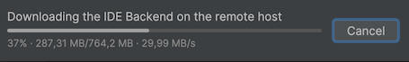

   The outcome of all this should be that you see the project opened, as a remote development session:
   
   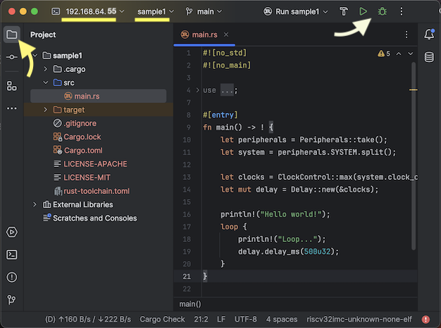
   

**Build and Debug!!**

You should now be able to build the sample program (`src/main.rs`)..

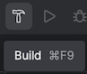

Click the hammer icon on the toolbar.

The build should start and show up in the console. 

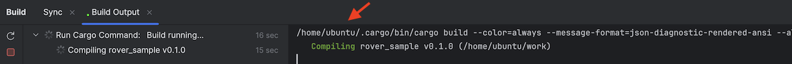

>Note that this happens in the remote instance.

<p />
>Keep an eye on the  build progress bar at the bottom of the IDE. It *will* take a few minutes to complete, fetching dependencies! Only then the `Run` and `Debug` icons light up!!


This means we can run and debug the remote instance. YAY!!!

Push `Run`.

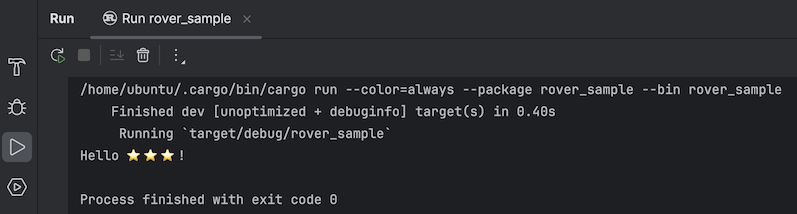

Make a breakpoint on line 2 (click it) and press `Debug`.

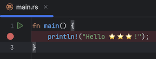

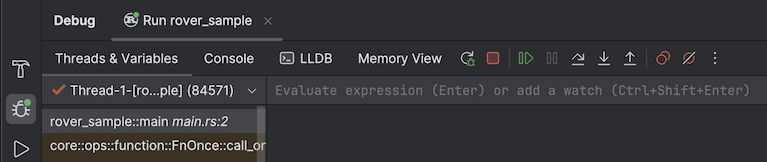

If we had variables, you would see their values here. Press `Resume Program` to let it run its way. 

This concludes our setup!

You now have a working, sandboxed environment for Rust development.


<!-- DISABLED; may not have been needed?
Next, we need to create a configuration so that the debugging features of the IDE can be utilized.

1. Click `Current File` > `Edit Configurations...`

   

	.. `+` > `Cargo`
	
	>If you've used any JetBrains IDEs before, this should look familiar. It's where compile/debug/test time properties are declared. You can define multiple such configurations, if you have the need.
	
   Switch `Run on:` to `SSH`
   
   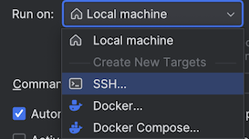

   ..and provide the host and username values
   
   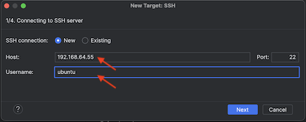

	>Note: The author doesn't know why JetBrains EAP wouldn't use the values we've already provided. 
	>If you don't remember the IP, you can run `make prep` again. It doesn't harm.

	Note that this is display `1/4` of the target wizard. Let's see what's coming - press `Next`.
	
   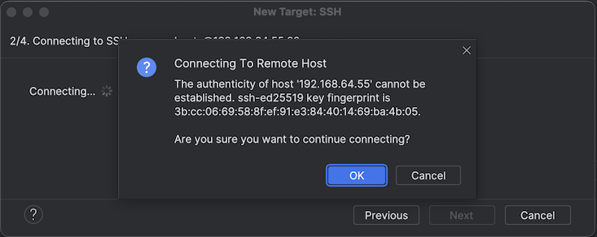

	We've seen that! Press `OK`.
	
	>⚠️ The reason we get the same request again must be due to still suboptimal integration between the Rust Rover (where we've OK'ed this) and the EAP client (who's now asking). Rust Rover is still in PREVIEW mode; hopefully this section of target creation gets ironed out before actual release!

   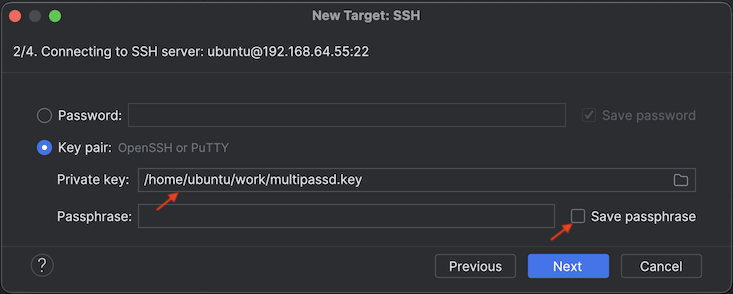

	>The "private key" asked here *should* be from our local (desktop) account, right?  But the dialog presents the file system of the remote instance... That's strange.
	>
	>We happen to share the key on that side, too, so let's pick it.
	>
	>Ideally, NONE OF THIS SHOULD BE SEEN since we've already touched base with the remote client.

	><font color=red>JetBrains BUG??</font> Should the dialog show local files - but then again, please cut this whole wizard out? 🙂

	
	
	Press `Next`.
	
	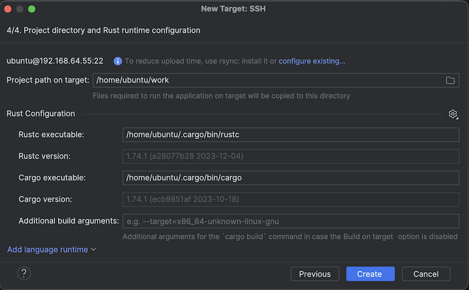

	Here, no changes are needed.
	
	>Note: If you click the "configure existing..." and check `rsync` connection, it seems to be there just fine.
	>
	><font color=orange>JetBrains: Can you remove the warning text if `rsync` connection is available?</font> - or am I doing something wrong..

	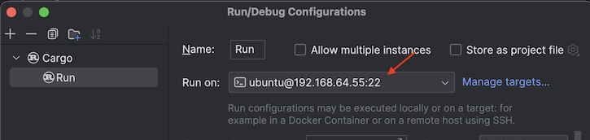
	
	We now have a Rust compilation/debug/testing target that's remote. Press `OK`.
	
	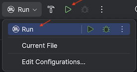
	
	Notice that there's a new `Run` target. Click it!

---
‼️	Here, EAP seems to get stuck for a while (> 1 min?) and then fails.


☐ <font color=red>JetBrains BUG</font> or an issue with my setup=?

---

The `Debug` feature doesn't seem to be implemented, at this moment (2023.3.1 EAP).

-->


<!-- DISABLED since we got Debug to work
## You leave me here??

Yes. :)

Though the IDE features seem to be still in flux, you can *absolutely* do development using the Rust Rover + EAP + Multipass toolchain.

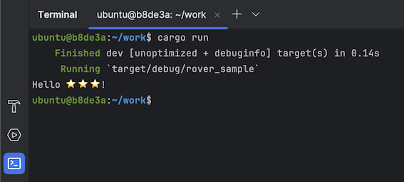

Press the terminal icon (highlighted in the screen shot) and you can do the normal `cargo run`, `cargo build` etc. in the remote instance.

What you'll get in addition is:
-->


## Communicating with the ESP32 device

*tbd. MUCH OF THIS deserves to get automated. You'll need to set up an `usbipd` server on a Windows machine, and provide its:
- ip
- busid
*

<!-- disabled!
### Prepare for `usbip` (communications with the embedded device)

- [ESP32-Mac](https://github.com/lure23/ESP32-Mac) (GitHub)

*tbd. Eventually, this should be automated. For now, do the steps manually.*

```
$ multipass shell embedded-rust-20
```

Starts a Multipass (Ubuntu) shell. You may want to change the look of this terminal window (right click > `Show Inspector`) to separate it from macOS terminals.

```
~$ sudo apt-get install linux-tools-generic
```

Installs `usbip` client.

```
$ sudo apt install linux-modules-extra-$(uname -r)
```

Installs some device drivers otherwise missing in the Multipass (Ubuntu 22.04 LTS) image:

```
$ sudo ls -al /lib/modules/$(uname -r)/kernel/drivers/usb/usbip/
[...]
-rw-r--r--  1 root root  66033 Nov 14 12:47 usbip-core.ko
-rw-r--r--  1 root root  76217 Nov 14 12:47 usbip-host.ko
-rw-r--r--  1 root root  58217 Nov 14 12:47 usbip-vudc.ko
-rw-r--r--  1 root root 108313 Nov 14 12:47 vhci-hcd.ko
```

```
$ sudo modprobe vhci-hcd
```

Starts the device driver modules.

```
$ sudo echo "vhci_hcd" >> /etc/modules-load.d/modules.conf
$ sudo echo "usbip_core" >> /etc/modules-load.d/modules.conf
```

Takes care that the modules are launched again, if there are VM restarts.


### Windows side preparation

Follow the steps in the [https://github.com/lure23/ESP32-WSL](https://github.com/lure23/ESP32-WSL) repo, to install device drivers and set up `usbip` sharing for them. 

>This requires a Windows computer. The author was unable to set up `usbipd` properly, on a Mac. See [https://github.com/lure23/ESP32-Mac](https://github.com/lure23/ESP32-Mac) if you wish to help.

```
> usbipd list
Connected:
BUSID  VID:PID    DEVICE
3-1    10c4:ea60  Silicon Labs CP210x USB to UART Bridge (COM4)
[...]
```

```
> usbipd bind -b 3-1
```

DO NOT do the `attach` from the Windows side. We do it from Multipass. For this, we need the Windows machine's IP - grab it e.g. from `ipconfig` output. (We're using `192.168.1.29`.)

>Naturally, the computers need to be in the same network. The port 3240 is used by the `usbip` protocol - both Mac and Windows should pass it through, so all this is possible.

```
~$ usbip list -r 192.168.1.29
Exportable USB devices
======================
 - 192.168.1.29
        3-1: Silicon Labs : CP210x UART Bridge (10c4:ea60)
           : USB\VID_10C4&PID_EA60\BC2F214F809DED11AAFA5F84E259FB3E
           : (Defined at Interface level) (00/00/00)
           :  0 - Vendor Specific Class / unknown subclass / unknown protocol (ff/00/00)
```

That looks plenty good!

Note that only one of the USB devices is presented to us. The one we used `bind` on the Windows side.

```
~$ sudo usbip attach -r 192.168.1.29 -b 3-1
```

To check what USB devices the VM sees (optional):

```
~$ lsusb
Bus 002 Device 001: ID 1d6b:0003 Linux Foundation 3.0 root hub
Bus 001 Device 002: ID 10c4:ea60 Silicon Labs CP210x UART Bridge
Bus 001 Device 001: ID 1d6b:0002 Linux Foundation 2.0 root hub
```

That should be it!
-->


## Next 

We can each go our ways, now. Use the `Makefile` in this repo as a basis for your Rust endeavours, if you like. Consider it Public Domain.

The author has an ESP32 board in mail, for being the target of his Rust adventures. There may be additions to this repo (thus its name, "Embedded Rover").

What's naturally welcome are:

- any corrections; either in Discussions, Issues or PRs. Thanks!!!
- additional material on setting up the same on Windows + WSL2 developer account (or Linux)

   >Note! Multipass requires a Windows Pro license, in order to use Hyper-X virtualization. Otherwise you'll need to install VirtualBox. 🥴


That's all for now! 🌼


## References

- [Enable ssh access to multipass vms](https://dev.to/arc42/enable-ssh-access-to-multipass-vms-36p7) (blog; Aug-22)

   Describes, how to use an existing ssh key, to reach Multipass. Needed for Rust Rover to do Remote Development.

- [Multipass Key-Based Authentication](https://www.ivankrizsan.se/2020/12/23/multipass-key-based-authentication/) (blog; Dec-20)
